6. Performance Analysis and Profiling
=====================================
This section is a comprehensive performance analysis and benchmarking of the model to understand its computational characteristics and scalability.
The codes to conduct the analysis is in the file ``performance_analysis.py``.

The main aim of the analysis is to see how the model performs with inputting 1K, 5K, and 10K datasets. On top of this, all analysis were done to 3 models of different complexities. 
Complexity here is only measured by the number of layers, and neurons per layer. The three models used are as follows:

Number of layers and neurons per layer:

- Small: [32]
- Medium: [64,32,16]
- Large: [128,64,32,16]

Note that other hyperparameters are kept the same. That is, for each model used:

- Optimise: Adam
- Activation Functoin: ReLU
- Max Iteration: 200 (except when profiling memory usage where max_it = 5)
- Learning rate: 0.001

My trainings and prediction tasks are running on the CPU. My laptop is MacBook Air with M2 chip. Hence all benchmarking and analysis done is CPU-based.

    Figure 7: My device specifications

The 1K, 5K, and 10K datasets are generated using ``make_regression`` function from ``sklearn.datasets`` module. The function is as follows:

.. code-block:: python

    from sklearn.datasets import make_regression

    def generate_samples(n_samples, n_features = 5, noise = 1, random_state = 42):
        """Function to generate samples for performance analysis"""
        X, y = make_regression(n_samples = n_samples, n_features = n_features, noise = noise, random_state = random_state)
        Xtr, Xte, ytr, yte = train_test_split(X, y, test_size = 0.2, random_state = random_state)
        Xtr, Xval, ytr, yval = train_test_split(Xtr, ytr, test_size = 0.25, random_state = random_state) # 0.25 x 0.8 = 0.2
        return X, y, Xtr, Xval, Xte, ytr, yval, yte

6.1 Training Time 
----------------------
The analysis measures training time of the full model with 200 epochs. Figure 8 is the resulting bar chart showing the training time for each model and dataset size.

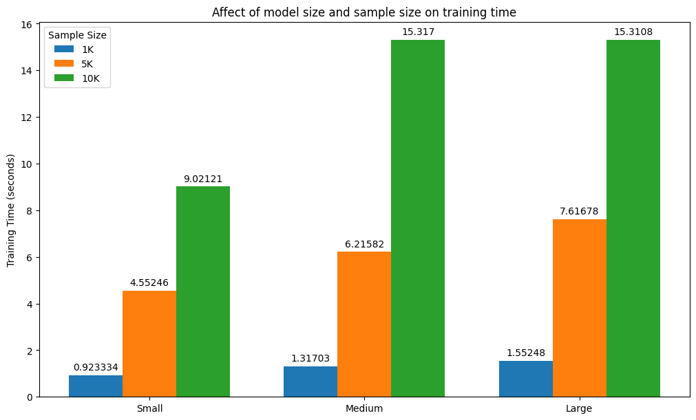

    Figure 8: Training Time Bar Chart

From the bar chart we can see that for every model complexity, training time scales with sample size. The results displayed is the average time taken from 10 iterations.
Across the three model complexities, when sample size changes from 1K to 5K, the training time scales by ~5; when sample size changes from 5K to 10K, the training time scales by ~2;when sample size changes from 1K to 10K, the training time scales by ~10.

This scaling beviour is linear, which matches the expectation that time complexity should be :math:`O(N)`.

(Note: Scalre factor = new_time / old_time)

However, the scaling is not as signifant for model complexities.When comparing time to train same-size dataset across different models, the difference in time taken for 1K dataset is less than 1 second; difference for 5K dataset is less than 2 seconds; althought there is ~6 seconds difference when training a 10K dataset in the simplest model compared to the medium and large ones, there is a plateau effect for training 0K dataset with medium or large complexity models. 

This may suggest a sign of bottleneck - the system may hit a limit on CPU thorughput or memory bandwidth, or that complexity increase is not significant enough to overcome constant factors.

6.2 Memory Usage Profiling
--------------------------------
The model used here is with maximum number of epochs = 5 to reduce the time taken for profiling. 
In summary of the tables (see figures below), by looking at parameters: 'Self CPU time' and CPU memory, the memory-heavy operators are ``aten::addmm`` and ``aten::mm`` - ones that involve matrix multiplication. And the largest number of calls are all from ``aten::empty_strided``. 
These conclusions are general for all 3 model complexities and all 3 dataset sizes, for both training and prediction models. Since prediction function involves less calculation than training, where foward pass and backward propagations are involed, so the Seld CPU time and CPU Memory usage tend to be much less for prediciton - with the maximum CPU memory usage is 1.84MB for the most complex model with 10K dataset, whilst training with medium model with 1K dataset is already 1.83MB.
Nonetheless, for both training and prediciton, Self CPU time and CPU Mem increases as model complexity and datasize increases.
Potential bottlenecks for memory-heavy operators may be CPU-Bound Exucutions. Since ``aten::mm`` and ``aten::addmm`` are used as building blocks for the layers of the neural network, this is where most FLOPs are required, and where CPU throughput is primarily spent. There may also be too many excessive tensors made by ``aten::empty_strided`` creating overhead.

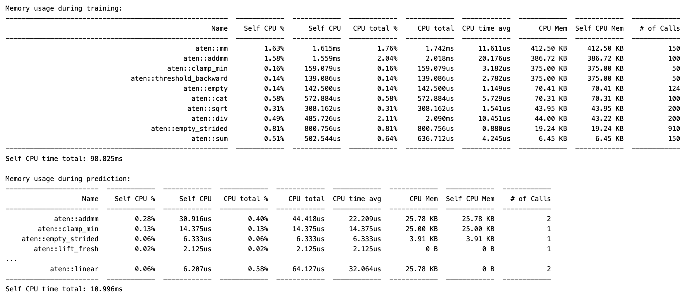

    Figure 9: Memory Profiling - Training Small Model (1K dataset)

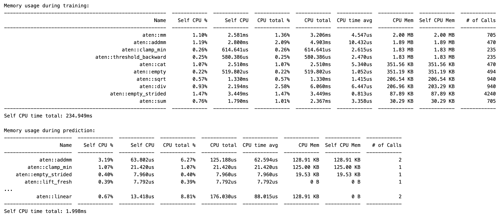

    Figure 10: Memory Profiling - Training Small Model (5K dataset)

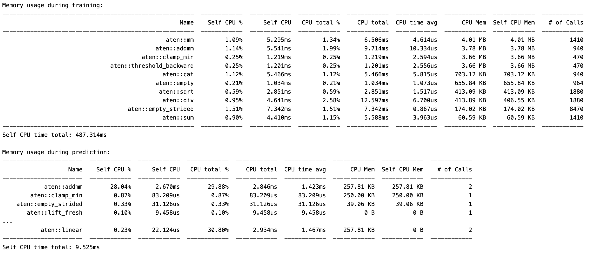

    Figure 11: Memory Profiling - Training Small Model (10K dataset)

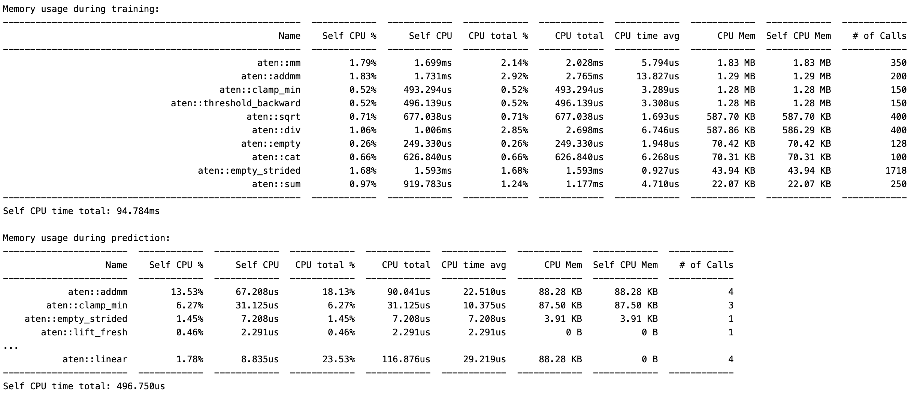

    Figure 12: Memory Profiling - Training Medium Model (1K dataset)

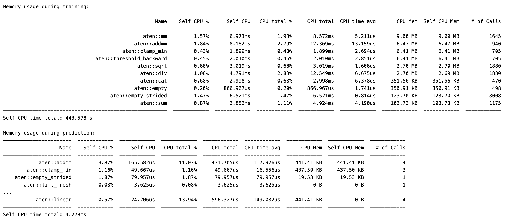

    Figure 13: Memory Profiling - Training Medium Model (5K dataset)

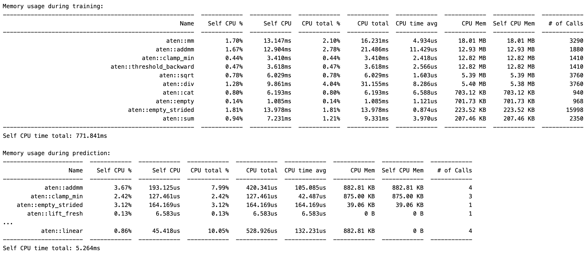

    Figure 14: Memory Profiling - Training Medium Model (10K dataset)

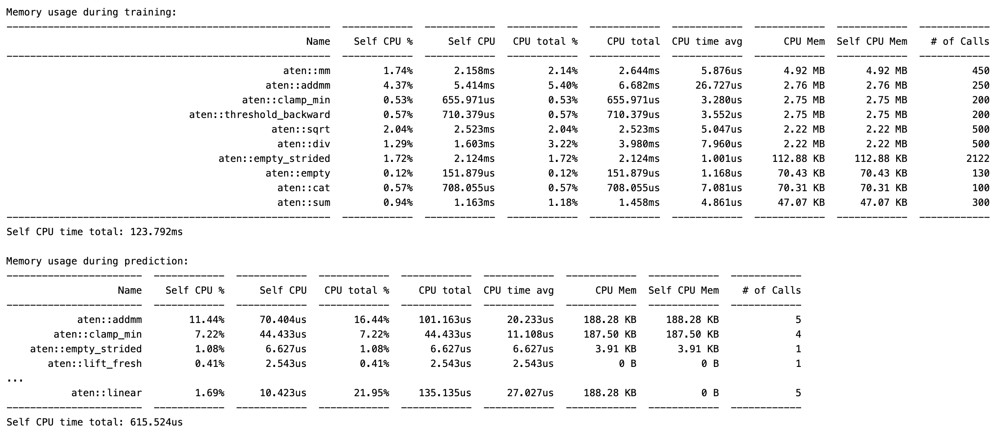

    Figure 15: Memory Profiling - Training Large Model (1K dataset)

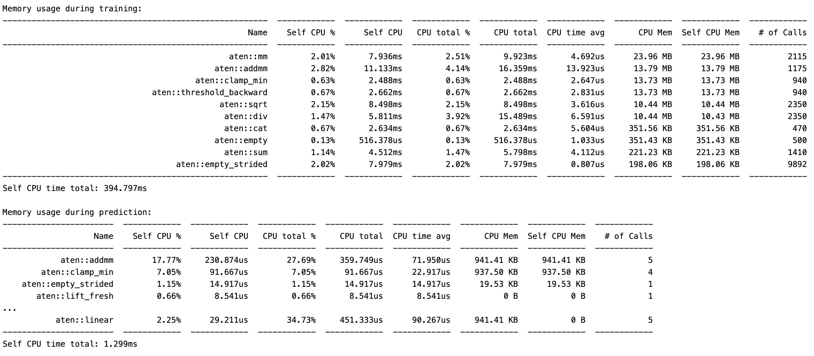

    Figure 16: Memory Profiling - Training Large Model (5K dataset)

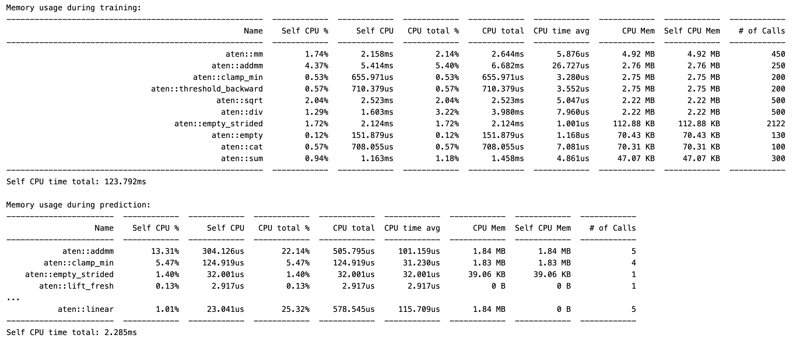

    Figure 17: Memory Profiling - Training Large Model (10K dataset)

6.3 Accuracy Metrics
-----------------------------
The accuracy metrics used here is Mean Squared Error (MSE) and R-squared (R2) score. 
The results are summarised in the following tables:

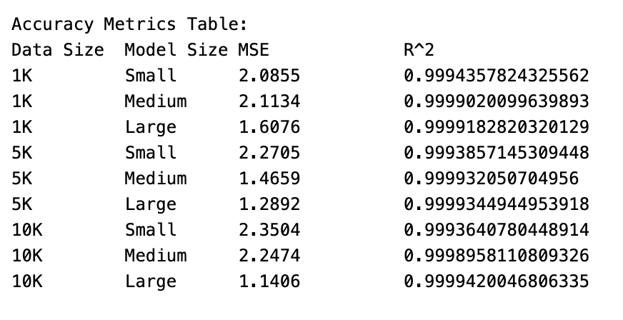

    Figure 18: Accuracy Metrics - Training Set

From the table, there is no clean pattern for MSE and :math:`R^2` value accross different dataset sizes. Since this is a light-weight, simple neural network, the MSE are already small, and :math:`R^2` values are already high (all ~0.999 to 3 significant figures).
The error is mainly caused by the synthetic noise I added when generating samples using ``make_regression`` from the ``sklearn`` package. There I have set noise = 1. The high :math:`R^2` score means the model is fitting well, and the remaining error is the irredusible white noise. 
The noticeable monotonic pattern is that for the most complex model out of the three, as dataset size increases, MSE decreases. MSE is the mean squared distance difference between true taget value and predicted, so the decrease in MSE value indicates a better accuracy.