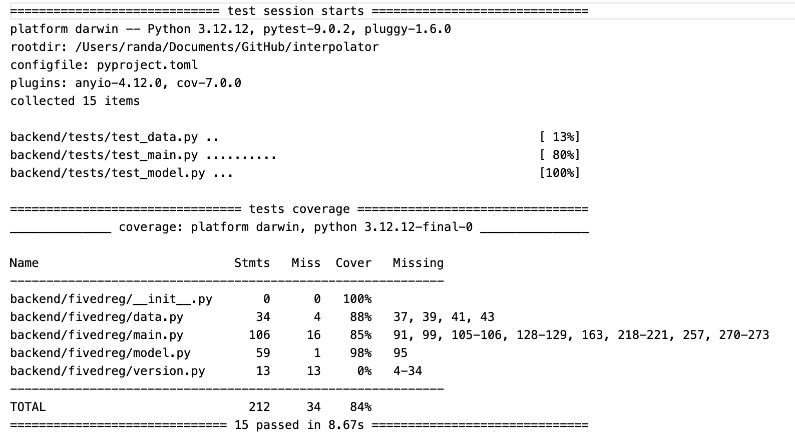

5. Test Suites
==============
This section provides a description of the test suite.

The tests in the `backend/tests/` folder are used to validate all system components and ensure reliability. The tests are all unit tests testing with assertions, and they are written and executed with Pytest. 
There are three main test files:

- test_data.py 
- test_main.py
- test_model.py

*test_data.py* creates a fixture as pickle file and tests data handling, data splitting and standardsing in the *load_data* and *split_data* functions in *data.py* respectively. The test includes testing if input features is 5D, as will as checking shapes of input X and target y. It also tests if the missing data is handle correctly by replacing them with column means. For splitting data, it ensures the total of training, tasting, and validation samples add up to the origianl total sample size. It also checks if data is standardised to have mean 1 and standard deviation 0.

*test_main.py* tests the API endpoints in *main.py*. It uses the TestClient from FastAPI to simulate requests to the API endpoints. The test includes uploading a file, previewing data, training the model, and making predictions. There are two types of tests here - one to check response when input is valid, and the other to check response when input is invalid (e.g. wrong shape or wrong file type). The test checks if the response status code is as expected (200 for valid input, 400 for invalid input), and if the response contains the expected keys.

*test_model.py* tests the FiveDRegressor class in *model.py*. It creates a fixture as dummy data for testing. The test includes checking if the model structure, training process, and prediction process are working as expected. Model structure is checked by ensuring the number of layers inputted is the number of hidden layers of the model, and also chekcing the target output shape is correct. The training test ensures that training time is finite and positive. The prediction test checks if the number of output matches the number of input samples, and also checks if output is a numpy array.

A coverage report for the tests is as shown below:

   Figure 6: Test Coverage Report

This report shows that there are in total 15 tests, all which passed, this could be indication that the system is reliable and robust. 
In total the coverage is 84% which means most functionalities has been tested and proved valid.