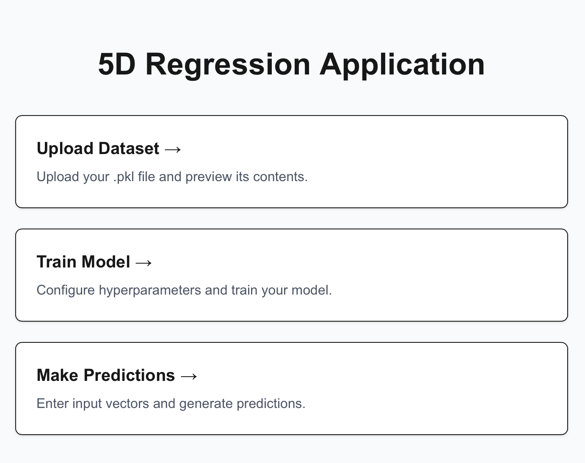
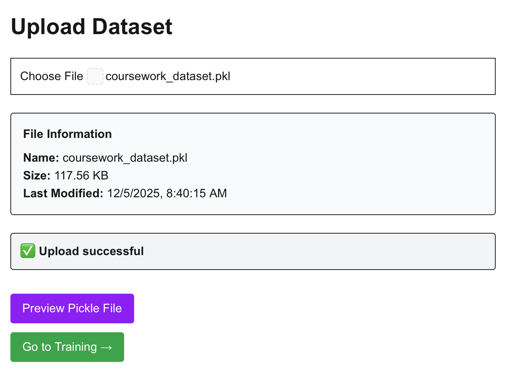
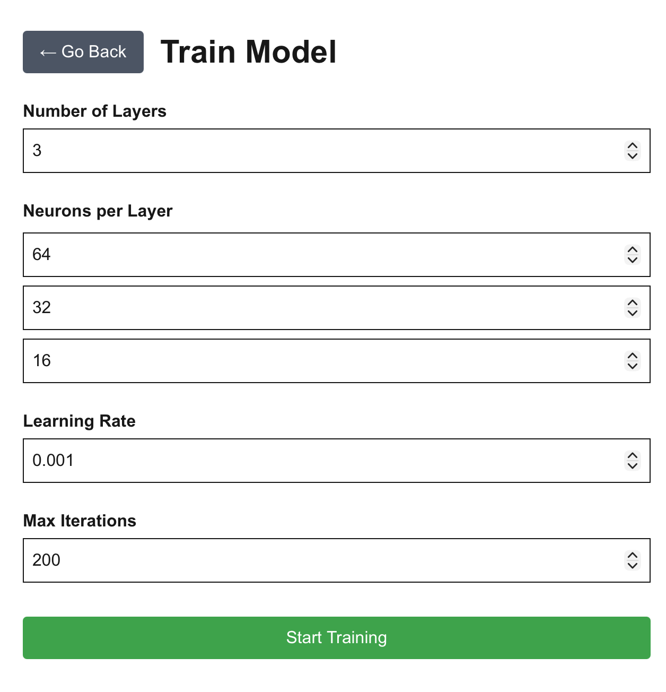
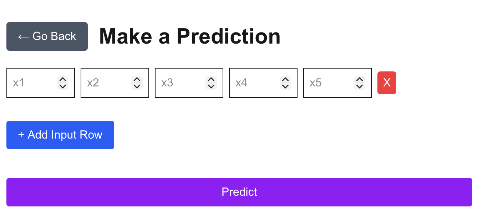

2. User Guides
==============

2.1 Prerequisites
-----------------
Before deploying the Interpolator application, ensure you have the following prerequisites installed:
- Docker

.. warning::
    **The Docker Daemon MUST be running.**

    Before proceeding to deployment, ensure you have launched the Docker and it is active.

2.2 Deployment Instructions
----------------------------
To deploy the Interpolator application using Docker, follow these steps:

1. git clone the Repository

   .. code-block:: bash

      git clone https://github.com/yourusername/interpolator.git
      cd interpolator

2. **Check Docker Status**
   Ensure that Docker is installed and active.
   Check by:

   .. code-block:: bash

      docker info

3. **Run Shell Script**
   To start the Docker container, execute the provided shell script:

   .. code-block:: bash

      ./scripts/start-docker.sh

   .. important::
      The script must be executed from the **root directory** of the cloned repository to ensure correct path resolution.

4. **Access the Application**
   Once the container is running, the terminal will output as Figure 1.

   .. figure:: _static/Images/fig1.png
      :width: 500px
      :align: center

      Figure 1: Docker Container Running Output

   The frontend application will be accessible at: http://localhost:3000 .
   To see the backend API documentation (Swagger UI), navigate to: http://localhost:8000/docs . More details about API endpoints is at <api_reference>.

2.3 Using the Interpolator Package
----------------------------------
Once the Interpolator package is deployed, interaction is available through the frontend interface. 
The frontend has four main sections:
- **Home**

   Figure 2: Frontend Home Page

- **Upload Dataset**: It is important to note that the dataset must be in pickle format (.pkl), and the dimension of input features is 5. In this page there is also the option to preview the uploaded dataset.

   Figure 3: Frontend Upload Dataset Page

- **Train Model**: Here users can configure hyperparameter for training. Configurable hyperparameters include:
    - Number of Layers
    - Neurons per Layer
    - Learning Rate
    - Max Iteations (Epochs)

    Note that training model is only possible after uploading a valid dataset.

   Figure 4: Frontend Train Model Page

- **Predict**: Here users can choose the number of rows of input data for prediction. Again, prediction is only possible after uploading a valid dataset and once the model has been trained.
   

   Figure 5: Frontend Predict Page

2.4 Stopping the Docker Container
----------------------------------
To stop the running Docker container, use the following shell script:

.. code-block:: bash

   ./scripts/docker-end.sh

